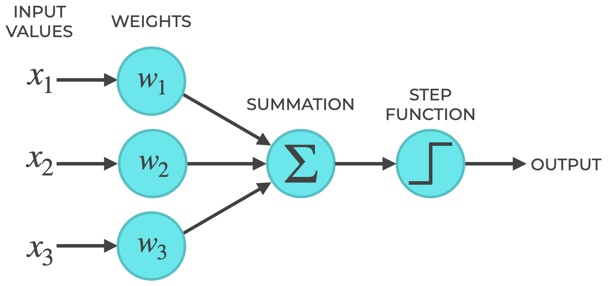
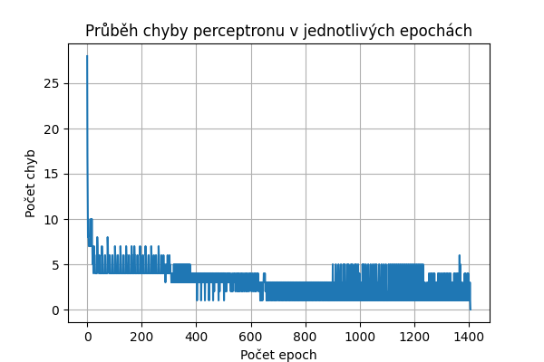
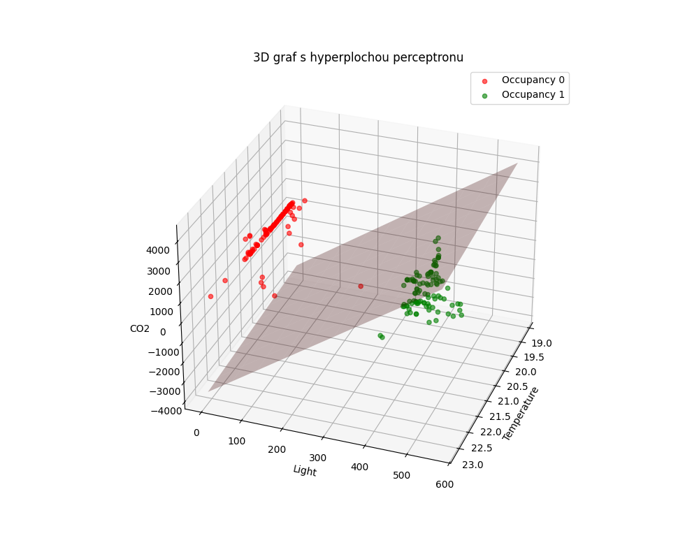

# Report – Perceptron

## 1. Teoretický úvod  
Perceptron je základní model umělé neuronové sítě, který funguje jako lineární klasifikátor. Jeho princip spočívá v lineární kombinaci vstupních proměnných s váhami a následném rozhodnutí pomocí prahové funkce. Formálně lze perceptron vyjádřit rovnicí:
$$
y =
\begin{cases} 
1, & \text{jestli } w_0 + \sum_{i=1}^{n} w_i x_i \ge 0 \\
0, & \text{jinak}
\end{cases}
$$
$$
\text{kde } w_0 \text{ je bias a } w_i \text{ váhy jednotlivých vstupů } x_i.
$$
  

Perceptron je vhodný pro úlohy, kde jsou data lineárně separabilní, tj. lze je oddělit pomocí jedné přímky (v 2D) nebo roviny (v 3D). U nelineárně separabilních úloh (např. XOR problém) tento model nestačí a je nutné použít pokročilejší architektury.
## 2. Dataset  
Použitý dataset obsahuje následující atributy:  
- **Temperature:** Teplota.  
- **Light:** Intenzita světla.  
- **CO2:** Koncentrace oxidu uhličitého.  
- **Occupancy:** Stav obsazenosti (0 = neobsazeno, 1 = obsazeno).

Data byla rozdělena na trénovací a testovací množinu v poměru 80:20. Důležitým aspektem bylo zachování původního poměru tříd v obou sadách, což zajišťuje, že model bude trénován a testován na reprezentativním vzorku.
## 3. Učení  
**Parametry učení:**
- **Počet vah:** Počet vah odpovídá počtu vstupních proměnných plus jeden (bias).
- **Inicializace vah:** Váhy jsou inicializovány náhodně kolem nuly.
- **Definice epochy:** Jedna epocha představuje průchod celým trénovacím datasetem.
- **Ukončení trénování:** Trénování se zastaví, pokud dojde k nulové chybě na trénovací sadě nebo pokud je dosaženo maximálního počtu 10 000 epoch.

Níže je zobrazen graf vývoje globální chyby v průběhu epoch. Z grafu je patrné, že perceptron úspěšně snížil chybovost a dosáhl nulové chyby před dosažením maximálního počtu epoch, což potvrzuje úspěšné naučení modelu.

## 4. Vyhodnocení a vizualizace výsledků  
Model byl otestován na testovací sadě a výsledky jsou shrnuty v následující tabulce:
| Dataset size |40||
|--------------|:--:|:--:|
|Correct|40|100.0%|
|Wrong|0|0.0%|

Dále byla vygenerována 3D vizualizace datasetu, ve které je znázorněna separační hyperplocha definovaná naučenými váhami perceptronu. Graf ukazuje, jak model odděluje vzorky třídy „0“ a „1“ v prostoru, definovaném atributy Temperature, Light a CO2.

